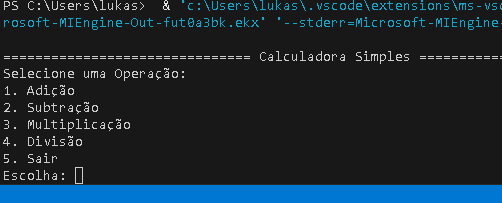

# 🧮 Calculadora Simples em C

Uma calculadora de terminal desenvolvida na linguagem **C**, que realiza as operações básicas, **adição**, **subtração**, **multiplicação** e **divisão**.
O projeto também inclui trativas, como **validação de entrada** e **divisão por zero**.


## 📸 Demonstração

Uma forma de exemplo de como ocorre a execução do código:



=============================== Calculadora Simples ===============================
Selecione uma Operação:
1. Adição
2. Subtração
3. Multiplicação
4. Divisão
5. Sair
Escolha: 1
Digite o primeiro número: 5
Digite o segundo número: 7
Resultado: 5.00 + 7.00 = 12.00
Deseja realizar outra operação? (s/n): n
Obrigado por usar a calculadora! Até a próxima.

## ⚙️ Instalação e Pré-requisitos

### 🧰 Pré-requisitos
- Compilador C (como **gcc** ou **clang**)
- Sistema operacional com terminal (Linux, macOS ou Windows com MinGW)

### 💻 Instalação

Clone o repositório:

```bash
git clone https://github.com/GiordanoSoares/CalculadoraEmC.git
cd CalculadoraEmC
```

Compile o código:

```bash
gcc main.c -o CalculadoraEmC
```
Execute o programa:

```bash

./CalculadoraEmC
```

## 🚀 Uso e Exemplos

1. Execute o programa;
2. Escolha uma das operações disponíveis no menu:
   - 1: Adição  
   - 2: Subtração  
   - 3: Multiplicação  
   - 4: Divisão  
   - 5: Sair  
3. Insira dois números conforme solicitado;
4. Veja o resultado no terminal;
5. Escolha se deseja realizar outra operação.

Exemplo:
```
Digite o primeiro número: 10
Digite o segundo número: 5
Resultado: 10.00 / 5.00 = 2.00
```

---

## 📂 Estrutura do Projeto

```
calculadora-c/
│── main.c
│── README.md
│── LICENSE
└── assets/
    └── demo.gif
```

## 📜 Licença

Este projeto está licenciado sob a **MIT License** — veja o arquivo [LICENSE](LICENSE) para mais detalhes.

---

## 👨‍💻 Autor

**Giordano Soares**  
💼 Técnico em Desenvolvimento de Sistemas  
📍 Caxias do Sul — RS, Brasil  